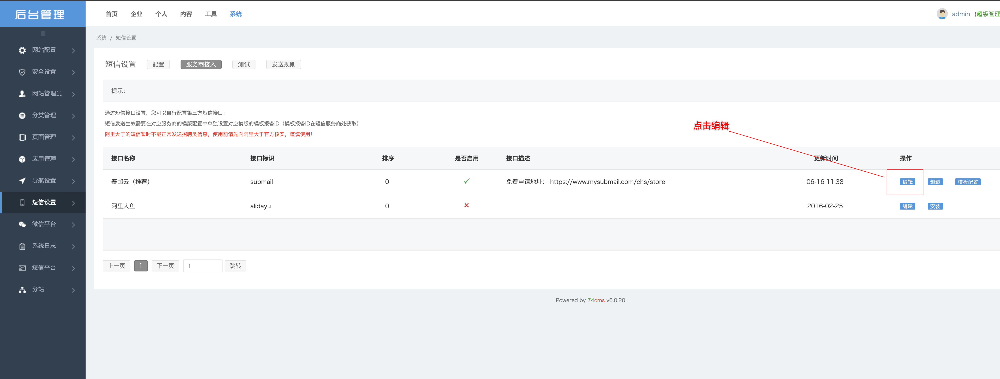
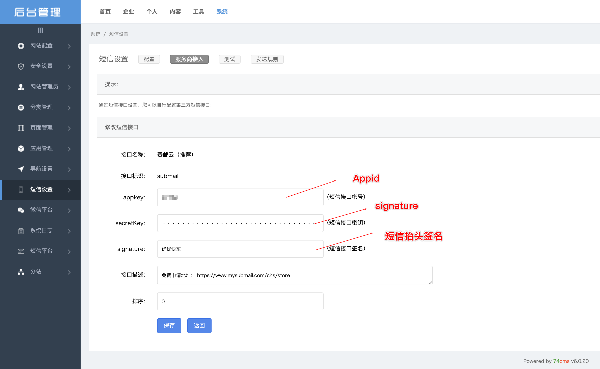

## OVERVIEW

### 74CMS Plug-Ins Overview

>骑士CMS是基于PHP+MYSQL的免费网站管理系统，提供完善的人才招聘网站建设方案。

74CMS  [官网地址](https://www.74cms.com)

How to use

+	修改 Application/Admin/View/default/Sms/config_edit.html
+	增加 Application/Common/qscmslib/sms/submail/submail.class.php
+ 	增加 Application/Home/Controller/SubmailController.class.php

	1.将插件内的文件分别覆盖至你的网站系统根目录
	2.进入系统->短信设置->服务商接入，填写赛邮云短信相关的账号密码

[Github项目地址](https://github.com/submail-developers/74cms_sms) &nbsp;&nbsp;&nbsp; [点击下载](https://github.com/submail-developers/74cms_sms/archive/master.zip)
