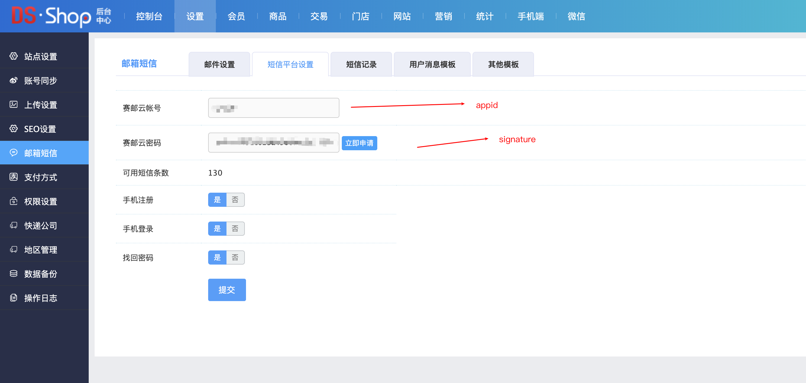
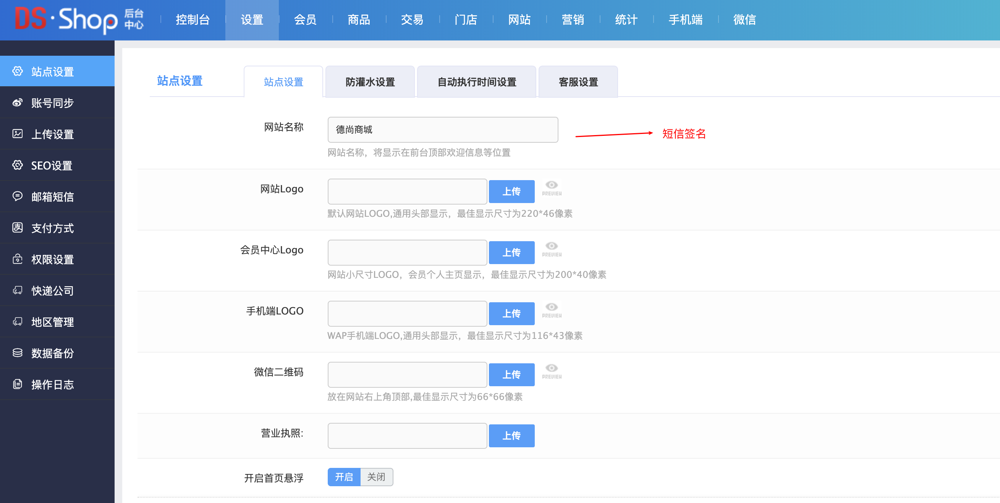

## OVERVIEW

### DSSHOP短信 Plug-Ins Overview

>DSShop是长沙德尚网络科技有限公司推出的一款单店铺移动商城网店系统

------
DSSHOP  [官网地址](http://www.csdeshang.com/home/dsshop/index.html)

[V6.0.4](https://github.com/submail-developers/dsshop_sms/archive/master.zip)

How to use
-	application/admin/controller/Message.php
-	application/admin/view/message/mobile.html
-	extend/sendmsg/Sms.php

        1：本插件针对DSShop单店铺商城_v1.6版本开发，安装前请仔细核对你的系统版本。
        2：插件内部文件均为为对系统原文件的修改，如果你的系统经过二次开发，请先核对插件文件代码，否则请直接将插件内的文件覆盖原文件。
        3：把下载好的DSShop单店铺商城系统赛邮云短信插件程序解压覆盖到网站根目录。
        4：进入系统后台->设置->邮箱短信->短信平台设置，填写赛邮云短信配置信息，保存即可。

        5：进入系统后台->设置->站点设置，网站名称即为短信签名。

[Github项目地址](https://github.com/submail-developers/dsshop_sms)&nbsp;&nbsp;&nbsp;[点击下载](https://github.com/submail-developers/dsshop_sms/archive/master.zip)
