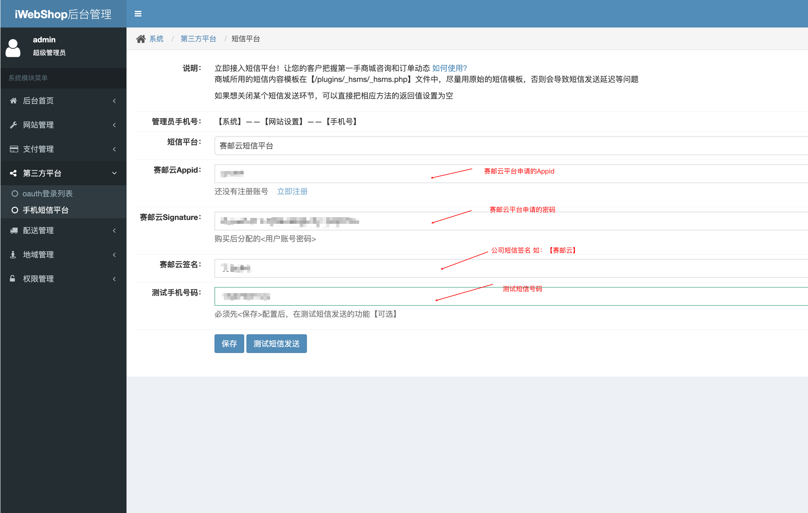

## OVERVIEW

### IWEBSHOP Plug-Ins Overview

>iWebShop是一款基于PHP语言及MYSQL数据库开发的B2B2C单用户和多用户开源免费的商城系统。

------
IWEBSHOP  [官网地址](http://www.aircheng.com/)

[V5.7.0303](https://github.com/submail-developers/iwebshop_sms/archive/master.zip)

How to use

-	classes/hsms.php
-	plugins/_hsms/submail.php
-	views/sysdm/system/hsms.html

使用方法
    把下载好的iWebShop 赛邮云短信插件程序解压覆盖到网站根目录
    注意：要将其中变量的目录放进相应变量中

    点击安装 后

    配置好申请的appid 和 appkey

[Github项目地址](https://github.com/submail-developers/iwebshop_sms)&nbsp;&nbsp;&nbsp;[点击下载](https://github.com/submail-developers/iwebshop_sms/archive/master.zip)
