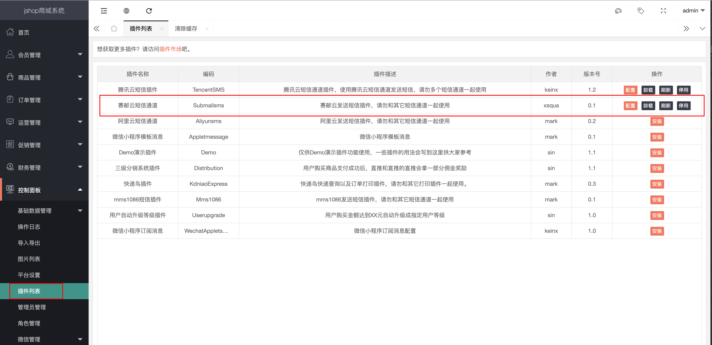

## OVERVIEW

### Jshop Plug-Ins Overview

>Jshop小程序商城 ，是一款开源的支持可视化布局 为大中小企业提供移动电子商务优秀的解决方案.

------
Jshop  [官网地址](https://www.jihainet.com/)

How to use

-	addons/Submailsms/config.html
-	addons/Submailsms/config.php
-	addons/Submailsms/Submailsms.php

使用方法
    把下载好的Jshop商城 赛邮云短信插件程序解压覆盖到网站根目录
    找到 控制面板->插件列表

    点击安装 后

    配置好申请的appid 和 appkey

[Github项目地址](https://github.com/submail-developers/jshop_sms)&nbsp;&nbsp;&nbsp;[点击下载](https://github.com/submail-developers/jshop_sms/archive/master.zip)
