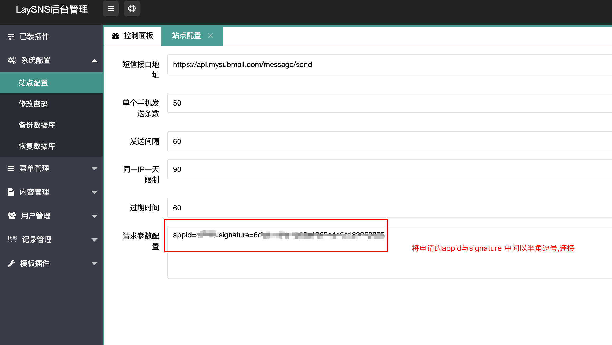
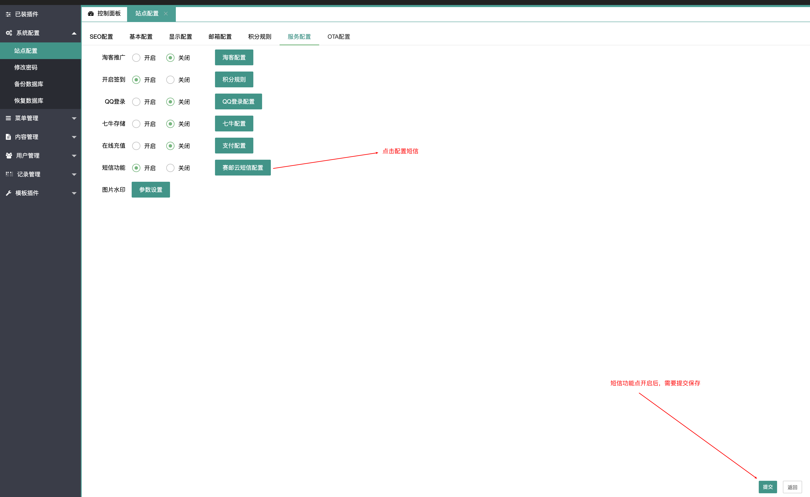

## OVERVIEW

### Laysns_SMS Plug-Ins Overview

------

How to use

使用方法
    1:首先将Laysns正确安装 
    2:将本目录下三个文件夹上传至网站根目录，覆盖原有文件  
    3:运行submail_install.php文件:http://你的网址/submail_install.php,  出现job done说明数据插 入成功  
    4:进入后台，刷新缓存，选择系统配置->站点配置->服务设置->短信平台设置，选择， 

5:安装完成后将submail_install.php删除 
6:测试手机注册 短信发送

