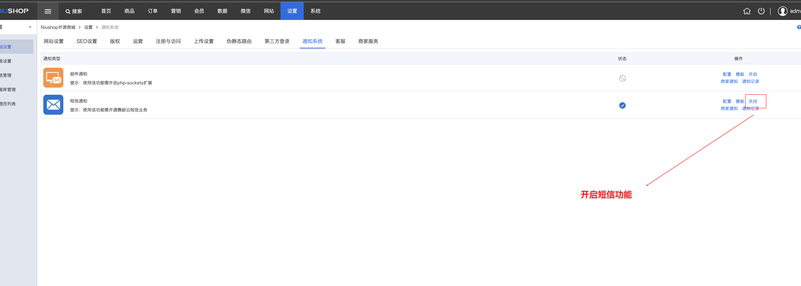
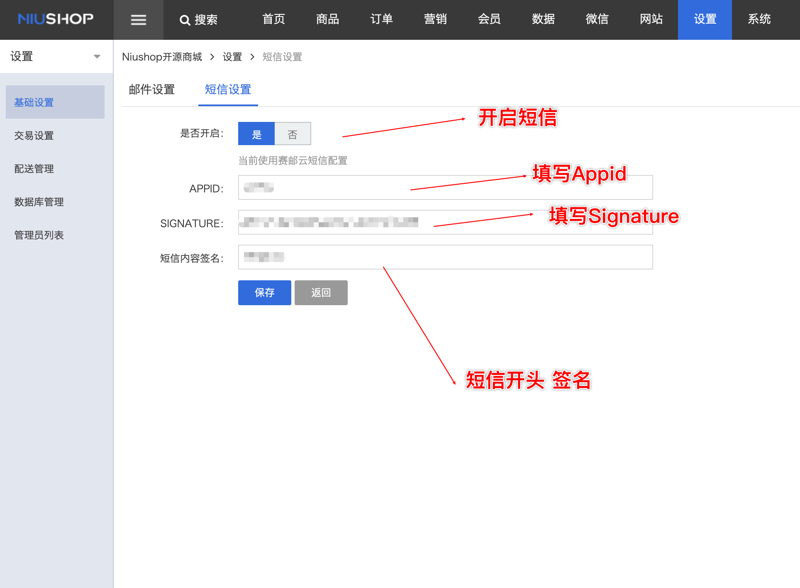
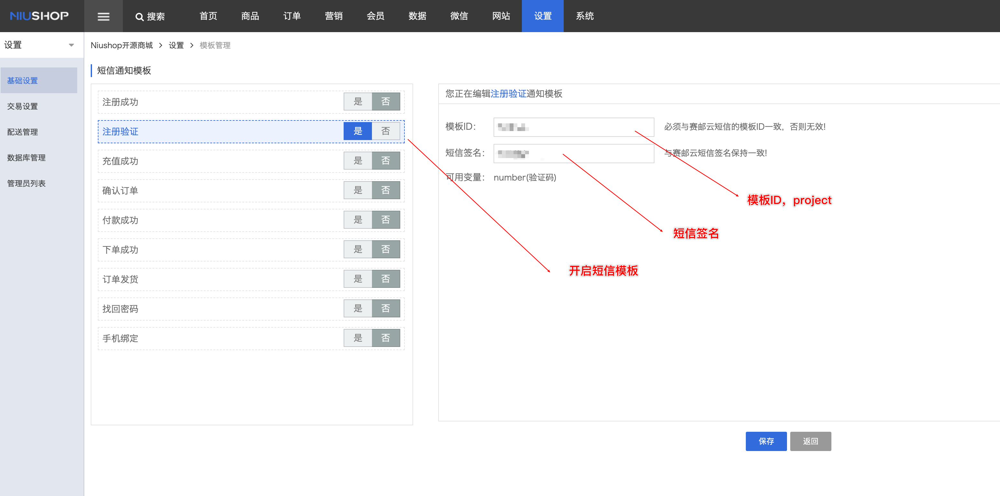
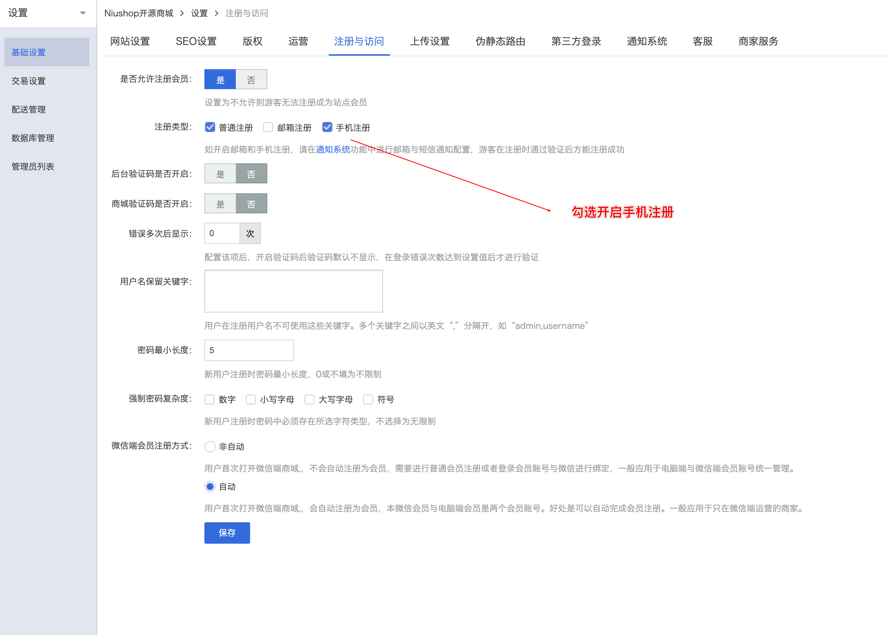

## OVERVIEW

### NIUSHOP Plug-Ins Overview

------

How to use

使用方法
>1：本插件针对NIUSHOP系统开发，安装前请先核对你的系统软件版本。

>2：插件内部分文件为对系统原文件的修改，如果你的系统经过二次开发，请先核对插件文件代码，否则请直接将插件内的文件覆盖原文件。

>3:进入后台->设置->通知系统->短信设置,填写赛邮云短信Appid，Appkey，

>3:进入后台->设置->通知系统->短信通知,填写赛邮云短信签名，模板ID。

>4:进入后台->设置->注册与访问->手机注册,勾选。

[点击下载](https://github.com/submail-developers/niushop_sms/archive/master.zip)

