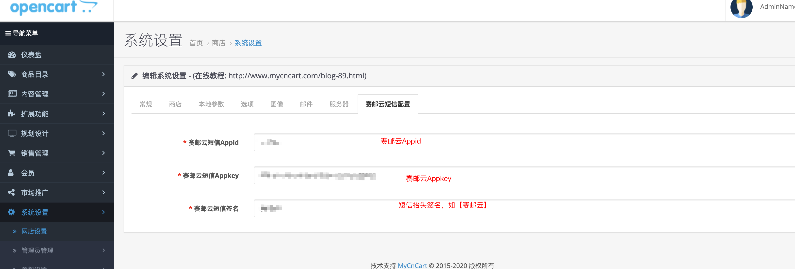

## OVERVIEW

### Opencart Plug-Ins Overview

------

How to use

使用方法
    1：本插件针对opencart系统开发，版本号：V30，安装前请先核对你的系统软件版本。
    2：插件内部分文件为对系统原文件的修改，如果你的系统经过二次开发，请先核对插件文件代码，否则请直接将插件内的文件覆盖原文件。
    3:进入后台->系统设置->网店设置->短信设置,填写赛邮云短信AppidAppkey，保存即可。

