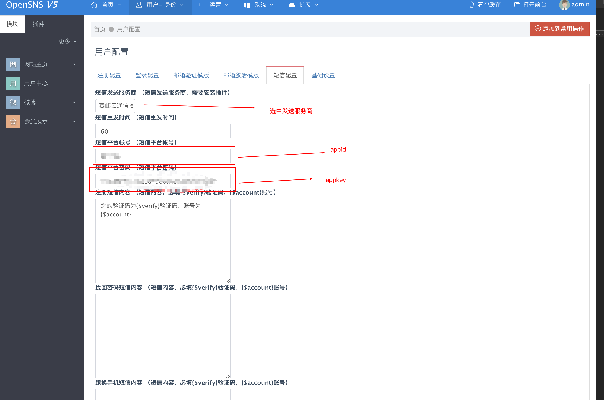
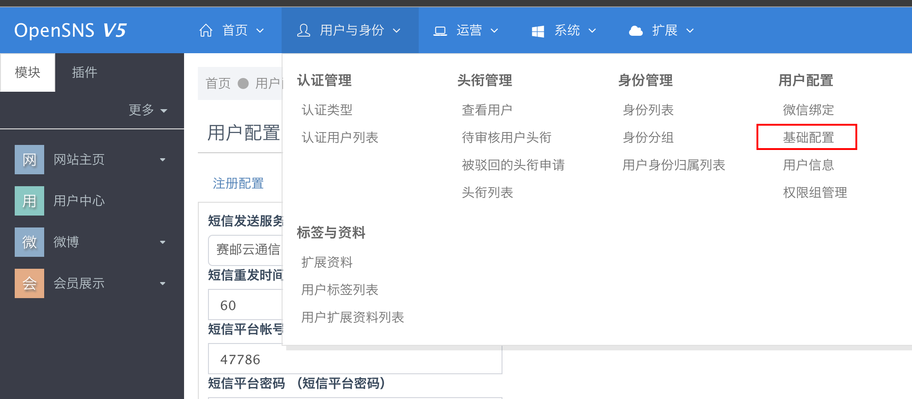
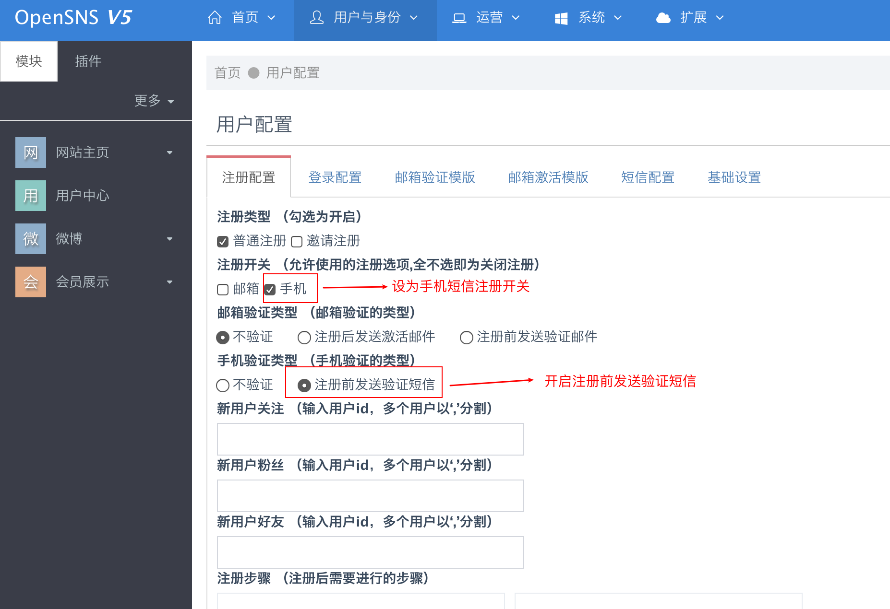
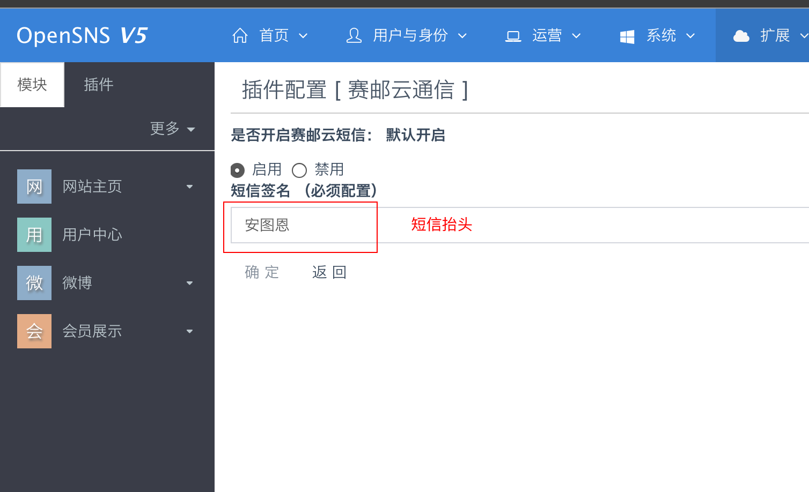

## OVERVIEW

### OPENSNS短信 Plug-Ins Overview

------
	OPENSNS短信 短信插件
How to use

        1：本插件针对OPENSNS开发，安装前请仔细核对你的系统版本。
        2：请直接将插件内的文件覆盖原文件。
        3：登录后台参照如下图所示位置更改配置。

[点击下载](https://github.com/submail-developers/opensns_sms/archive/master.zip)

