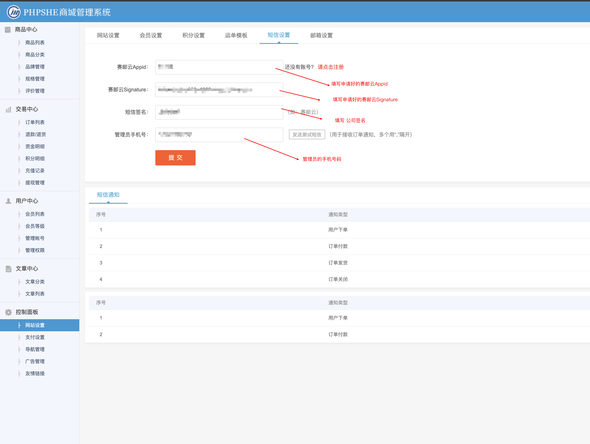

## OVERVIEW

### PHPSHE Plug-Ins Overview

>PHPSHE网上免费商城系统,分销商城系统具备电商零售业务所需的所有基本功能,以其安全稳定,简单易用,高效专业等优势赢得了用户的广泛好评,为用户提供了一个低成本,高效率的网上商城建设方案。

------
	PHPSHE 短信插件
How to use
-	hook/qunfa.hook.php
-	module/admin/setting.php
-	template/default/admin/setting_sms.html
-	submail.php

使用方法

    把下载好的PHPSHE 赛邮云短信插件程序解压覆盖到网站根目录

	访问http://域名/submail.php

    配置好申请的appid 和 appkey

[Github项目地址项目地址](https://github.com/submail-developers/phpshe_sms)&nbsp;&nbsp;&nbsp;[点击下载](https://github.com/submail-developers/phpshe_sms/archive/master.zip)
