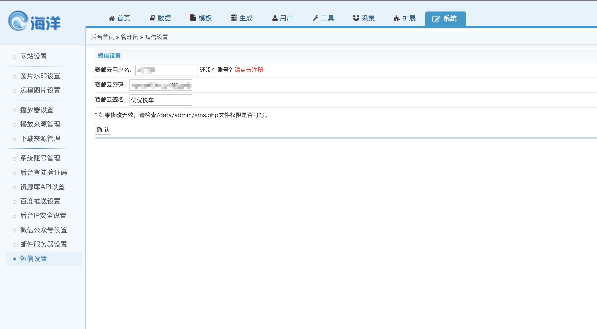

## OVERVIEW

### SeaCMS Plug-Ins Overview

>海洋cms是为解决站长核心需求而设计的内容管理系统。

------
SeaCMS  [官网地址](https://www.seacms.net/)

How to use
-	data/admin/sms.php
-	templets/default/html/reg.html
-	tyoxtl/admin_sms.php
-	tyoxtl/inc_menu.php
-	reg.php

使用方法
    把下载好的海洋CMS 赛邮云短信插件程序解压覆盖到网站根目录
    注意：要将其中变量的目录放进相应变量中

    点击安装 后

    配置好申请的appid 和 appkey
[Github项目地址](https://github.com/submail-developers/sea_sms)&nbsp;&nbsp;&nbsp;[点击下载](https://github.com/submail-developers/sea_sms/archive/master.zip)
