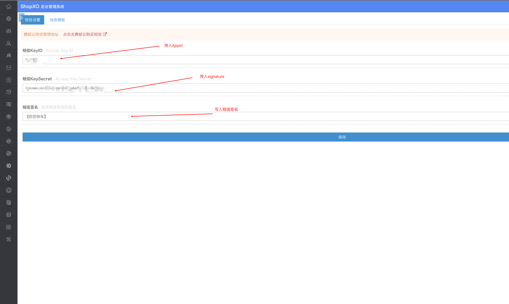
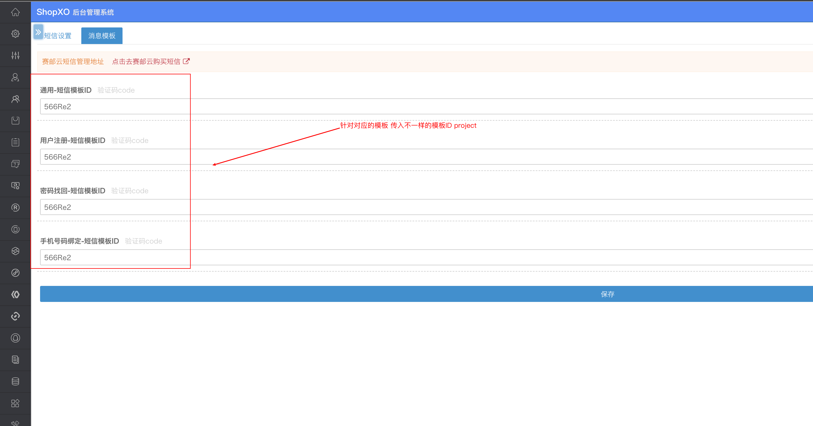

## OVERVIEW

### SHOPXO使用规范 Plug-Ins Overview

------
	SHOPXO 短信插件
How to use

使用方法
    把下载好的SHOPXO 赛邮云短信插件程序解压覆盖到网站根目录

然后就完成了短信配置

[点击下载](https://github.com/submail-developers/shopxo_sms/archive/master.zip)
