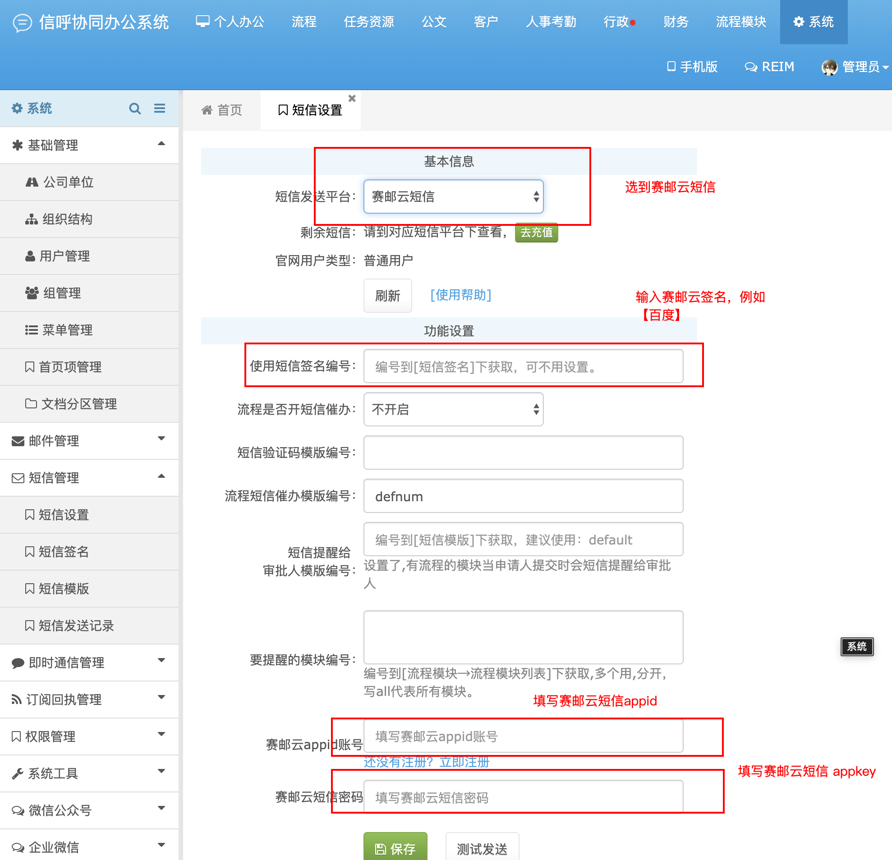

## OVERVIEW

### XinhuOA Plug-Ins Overview

>信呼-免费开源的办公OA系统，为各大中小企业通用型在线办公管理系统，精简，免费，开源，便捷方便使用的管理软件，让每个企业单位都有属于自己的办公系统，搭建自己企业单位网盘，搭建自己SAAS云办公平台

------
信呼  [官网地址](http://www.rockoa.com/)
[V2.1.6](https://github.com/submail-developers/xinhu_sms/archive/master.zip)

How to use

-	include/chajian/smsbaoChajian.php
-	webmain/system/sms/rock_sms_cog.php
-	webmain/system/sms/smsAction.php
-	submail_install.php

使用方法
    把下载好的信呼OA 赛邮云短信插件程序解压覆盖到网站根目录
  浏览器地址栏输入：

    http://域名/submail_install.php
   成功后请将Xinhu根目录下的submail_install.php文件删除

    （如果提示no access 请找到\webmain\webmainConfig.php 删除第一行代码 if(!defined('HOST'))die('not access'); ）

			短信验证码模版编号：defyzm
			流程短信催办模版编号：defnum
			短信提醒给：审批人模版编号：default

	Linux环境请设置插件文件的读写权限（777）

[Github项目地址](https://github.com/submail-developers/xinhu_sms/)&nbsp;&nbsp;&nbsp;[点击下载](https://github.com/submail-developers/xinhu_sms/archive/master.zip)

