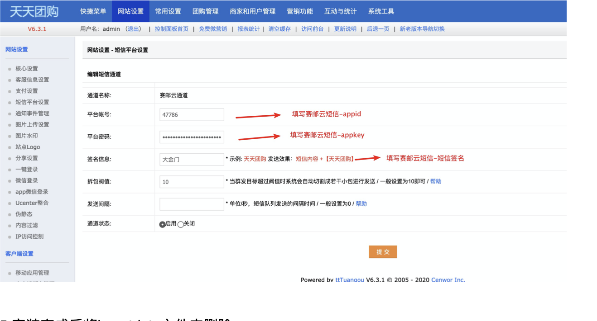
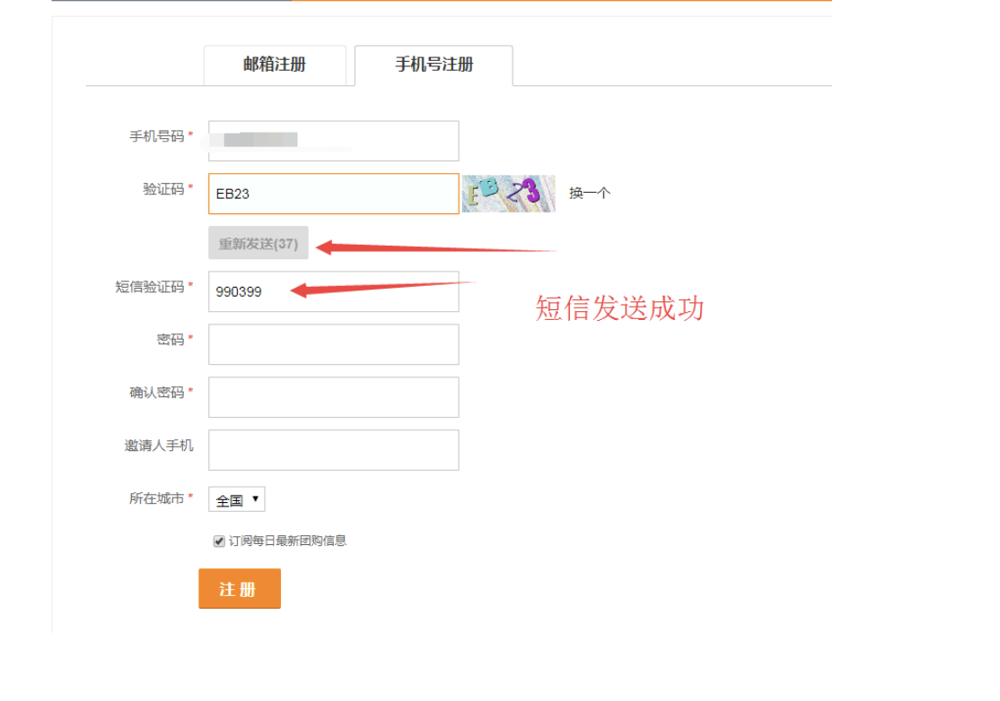

## OVERVIEW

### TTtuangou Plug-Ins Overview

------

How to use

使用方法
    1:首先将天天团购正确安装
    2:将本目录下三个文件夹上传至网站根目录，覆盖原有文件 3:运行insert.php文件:http://你的网址/insertdata/insert.php，出现job done说明数据插 入成功 4:进入后台，刷新缓存，选择网站设置->短信平台设置，选择短信宝，设置里面填写短信 宝帐户名和密码，签名等即可。

5:安装完成后将insertdata文件夹删除 6:测试手机注册 短信发送

